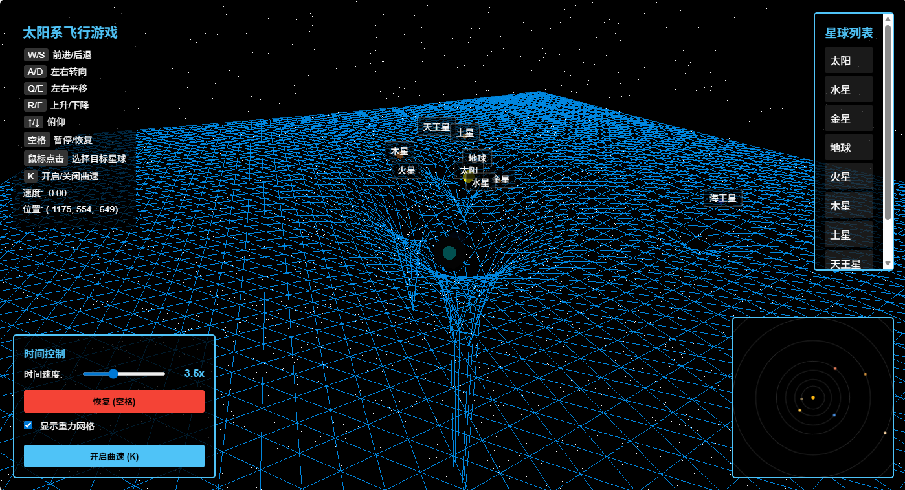
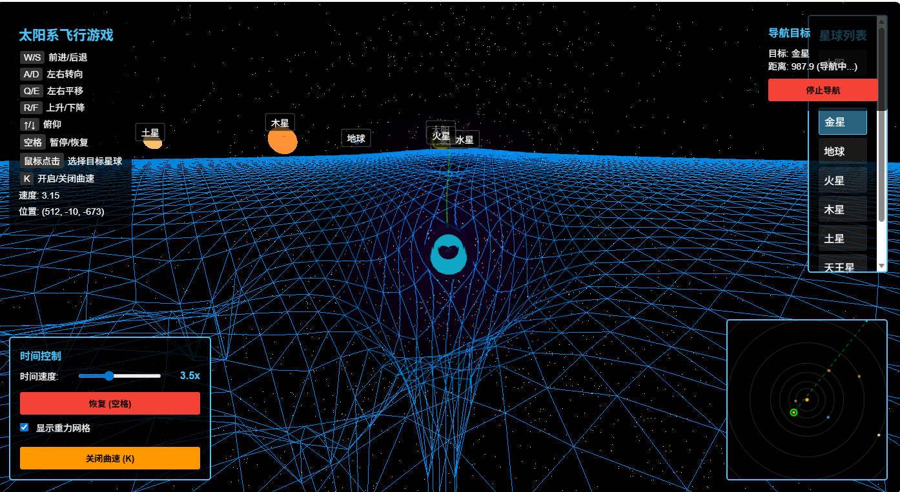
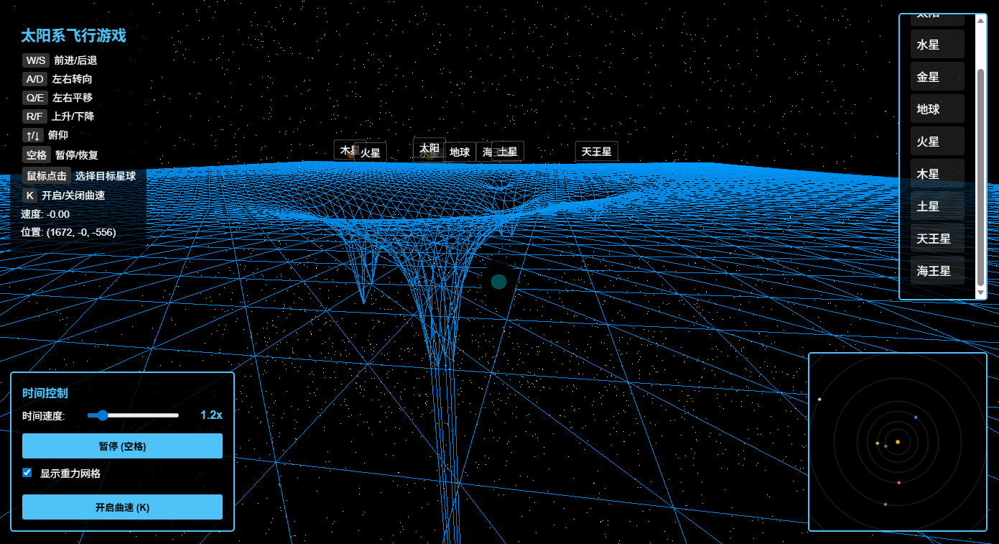
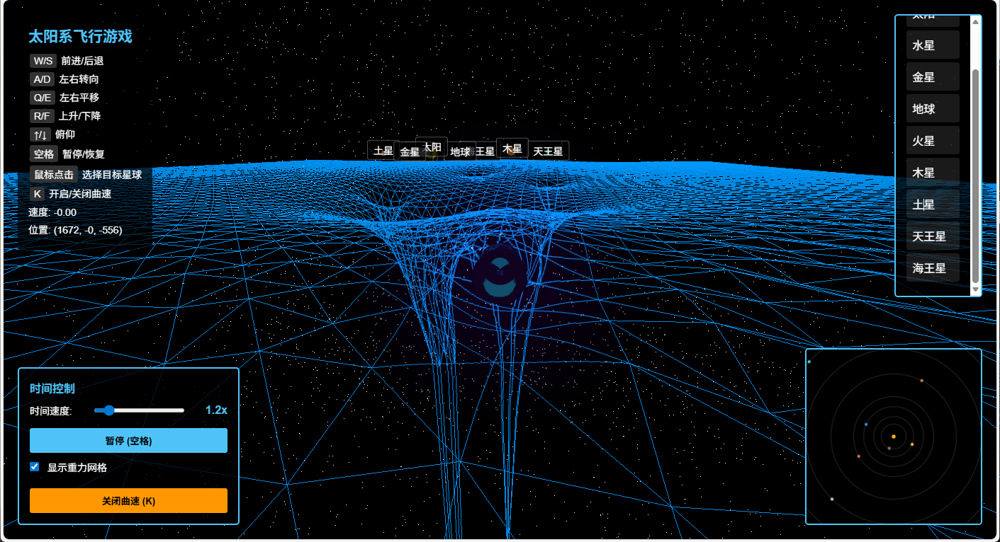

# 太阳系飞行游戏

一个基于 Three.js 的 3D 太阳系飞行模拟游戏，你可以驾驶飞船在太阳系中自由飞行。

## 功能特点

 完整的太阳系模型（太阳和8大行星）
 真实模拟的曲率飞行
 模拟的时空网格
 真实的行星轨道运动
 可控制的 3D 飞船
 导航系统
 地图系统

 1.主界面
 
 2.开启曲率以及导航
 
 3.开启曲率前后
 
 


## 安装步骤

1. 安装依赖:
```bash
npm install
```

2. 启动开发服务器:
```bash
npm run dev
```

3. 在浏览器中打开显示的本地地址（通常是 http://localhost:5173）

## 控制说明

- **W/S**: 前进/后退
- **A/D**: 左右转向
- **Q/E**: 左右平移
- **空格/Shift**: 上升/下降
- **↑/↓**: 俯仰控制

## 太阳系包含的天体

- 太阳（中心恒星）
- 水星
- 金星
- 地球
- 火星
- 木星
- 土星
- 天王星
- 海王星

## 技术栈

- Three.js - 3D 图形库
- Vite - 构建工具
- JavaScript (ES6+)

## 项目结构

```
.
├── index.html      # HTML 入口文件
├── main.js         # 游戏主逻辑
├── package.json    # 项目配置
└── README.md       # 项目说明
```

## 开发提示

- 飞船初始位置在 (0, 0, 200)
- 可以通过修改 `main.js` 中的 `solarSystemData` 调整行星参数
- 可以通过修改 `Spaceship` 类的参数调整飞船性能

祝你飞行愉快！
